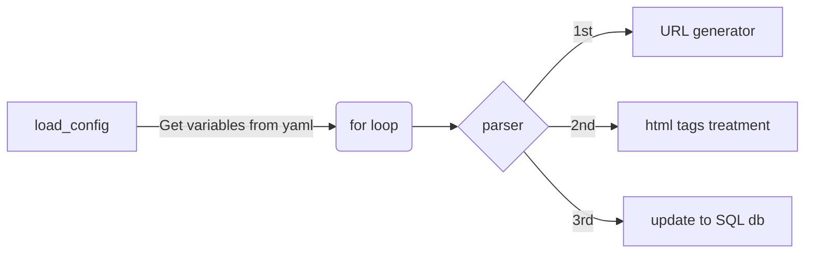

# architecture

## design

* What is the purpose for this project?
  * For scraping ACG collect names with specific user

* Which level?
  * Application layer ?

* How many user will use?
  * lower than 10 users

## resources

* a programming language to deal with computing
* an Linux server for computing
* an SQL database for stored info from compting

## diagrams



## guides or tips

* web crawler vs web scraping?
* [Design a web crawler](https://github.com/donnemartin/system-design-primer/blob/master/solutions/system_design/web_crawler/README.md)

## Dev logs

* db_init?

## Data Structures and Algorithms

* yaml
    * Data serialization format
    * 可以使用YAML表示字典、列表和鍵值對等資料結構。
    * In our use case, <class 'dict'>

## file strutures

.
├── architecture
├── db_settingup
└── src
    └── test

## Where to execute?

```shell
#If run this?
python  src/main.py
#FileNotFoundError: [Errno 2] No such file or directory: '../my_self.yaml'
#PATH setting ERROR

```

## Test

```shell
#change execute folder
cd src
#measure time for executing
time python main.py

```